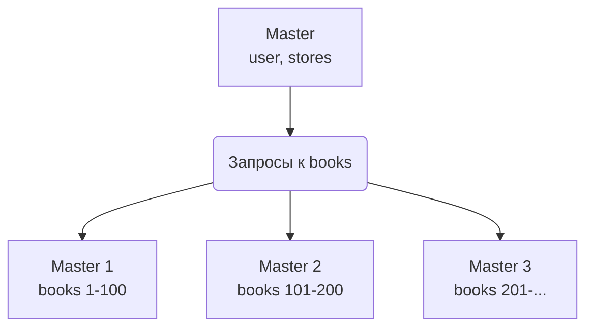
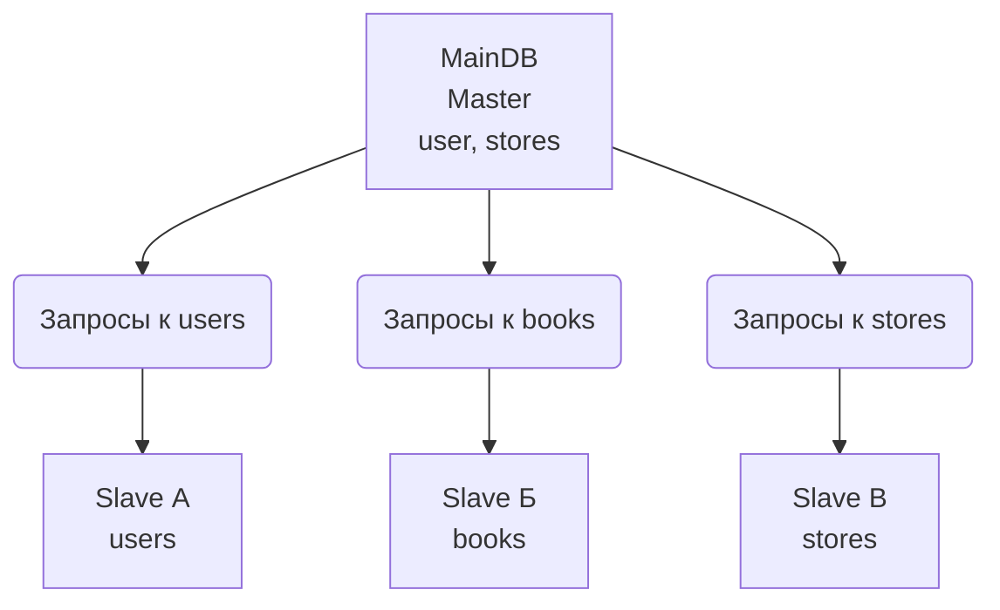

# Домашнее задание к занятию "`Репликация и масштабирование. Часть 2`" - `Росторгуев Никита`

---

### Задание 1. Основные преимущества использования масшабирования методом:

##### Активный master-сервер и пассивный репликационный slave-сервер  

- **Отказоустойчивость** - при сбое мастера администратор может переключить трафик на слейв  
- **Безаварийное резервное копирование** - бекап можно создавать на слейве без блокировки таблиц на мастере  
- **Разгрузка мастера** - тяжелые запросы на чтение выполняются на слейве  
- **Геораспределение** - слейв можно расположить удаленно от мастера, чтобы ускорить чтение для удаленных пользователей  

##### Master-сервер и несколько slave-серверов  

*Дополнительно к вышеуказанным преимуществам*  
- **Балансировка нагрузки чтения** - запросы можно распределять между слейвами с помощью балансировщиков  
- **Горизонтальное масштабирование** - при росте нагрузки на чтения, можно добавить еще один слейв  

---

### Задание 2. План для вертикального и горизонтального шардинга БД

##### Горизонтальный шардинг:
*Книг в БД так много, что таблица с ними не помещается на один сервер, разобью таблицу **books** по серверам*

##### Вертикальный шардинг:
*Чтение по каждой таблице очень велико, разнесем таблицы **books**, **users**, **stores** на разные слейвы*

---
